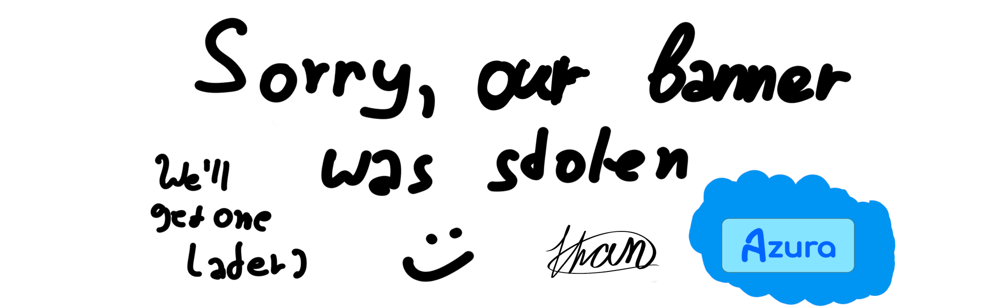

#  AzuraLang

<a href="https://github.com/AzuraCorp/AzuraLang/issues"></a>
<a href="https://github.com/AzuraCorp/AzuraLang/releases"></a>
<a href="https://github.com/AzuraCorp/AzuraLang/wiki"></a>
<a href="https://github.com/AzuraCorp/AzuraLang/pulls"></a>
<a href="https://github.com/AzuraCorp/AzuraLang?tab=LGPL-3.0-1-ov-file"></a>
<a href="https://github.com/AzuraCorp/AzuraLang/graphs/contributors"></a>
<!--<a href="https://github.com/AzuraCorp/AzuraLang/deployments"></a>-->
## What is AzuraLang?

AzuraLang is a python-library/toolkit to easily make Python-based apps using tTk¹.

> ¹tTk = themed Tkinter, a Python library to make better looking/themed tkinter windows/apps.

It is a high-level library, that is really easy to use, mod and contribute.

## Installation

### Stable releases:

```bash
pip install AzuraLang
```

### Unstable/Beta releases

To get all the versions check out our wiki page  with the installation guide on _all<sup>*1</sup>_ systems.

## Wanna join/help?

##### If you want to join/help me, write us an e-mail to 'azuracorp@duck.com' to    get our attention.


**Notes:**
<sup>*1</sup>All supported systems(currently supported Arch-, Mint-/Ubuntu-/Debian-, Fedora- linux; Windows, MacOS/OS-X with pip/python installed)